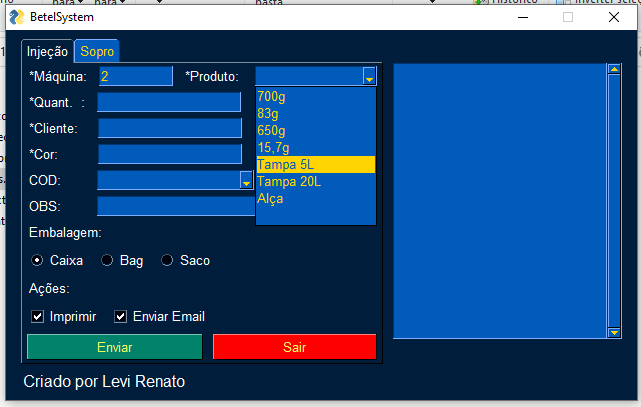
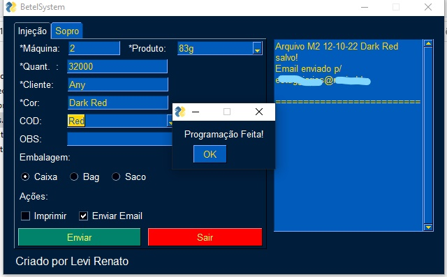
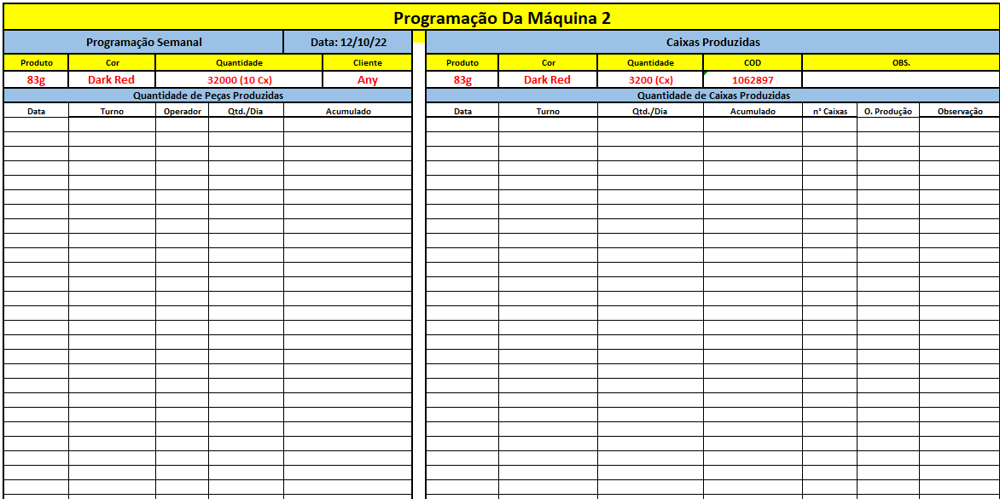
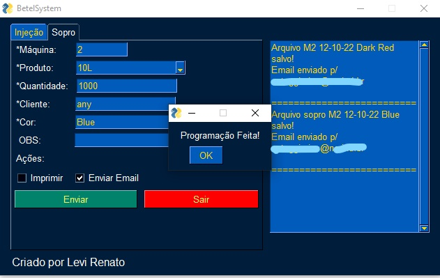
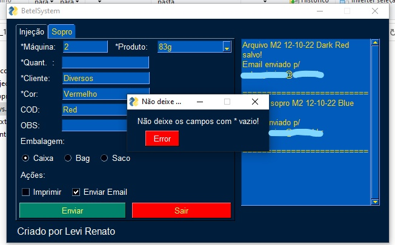
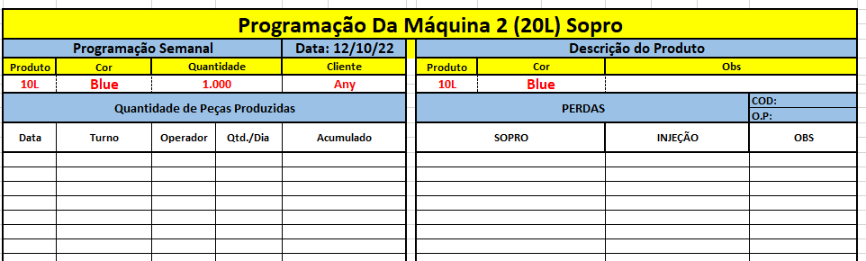

# BetelSystem
## A litle software that creates a spreadsheet, prints it and sends it by email. 

Hello everyone, as you know i'm from Brazil so that program have some variables and piecis in portuguese. I work in a factory of pet bottle, and some times i have to do a sheet with information to be write throughout the week, the sheet need be impress and send by email to my boss. So i do that program to did that for me.

Please take a look in project, and give some advices or pull requests (maybe both). I will be very grateful, thanks for your attention!

##

